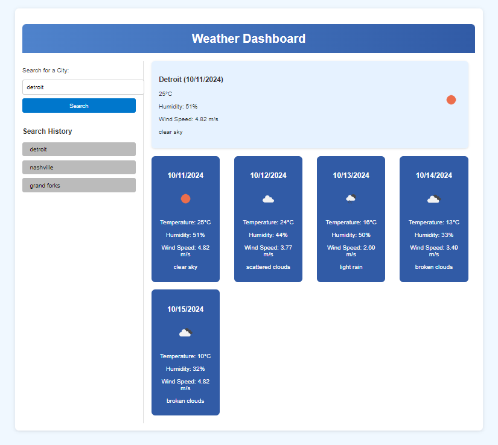

# mod6challege Weather Forcast
Mod 6 challenge Weather Forcast

## Description

weather dashboard using the OpenWeather API to display current weather and a 5-day forecast for cities. The app will feature dynamic HTML and CSS updates and save search history using localStorage.

## Table of Contents

- [Description](#description)
- [Installation](#installation)
- [Usage](#usage)
- [License](#license)
- [Contributing](#contributing)
- [Tests](#tests)
- [Questions](#questions)

## Installation

follow link to: https://erinspix.github.io/mod6challege/

## Usage

navagate to home page, click  get started, add note and  description in text boxes, save, repeat. users will be able to click small garbage pail icons to delete tasks.

search for a city, and check that the weather information displays and that the search history updates.
## License

This project is licensed under the MIT license.

## Contributing

I made this using provided code.

## Tests

search for a city, and check that the weather information displays and that the search history updates.

## Questions

For any questions, please contact me with the information below:

GitHub: [GitHub: erinspix](https://github.com/GitHub: erinspix)  
Email: e.spix@yahoo.com
- **Home**: 
